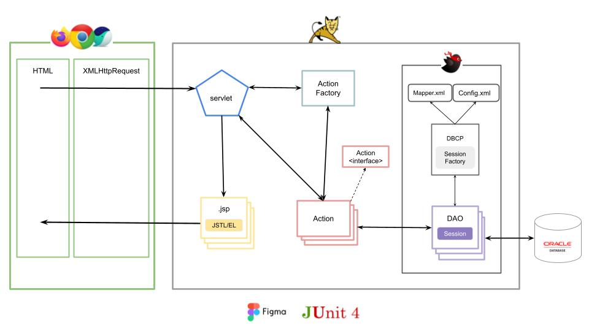
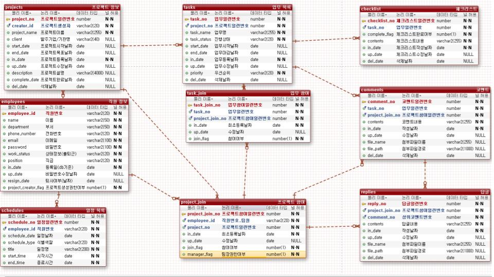

# KOSTA 1차 프로젝트 - 1조
## ProMeet - 프로젝트 관리 솔루션 (MVC Model2)

## 프로젝트 소개
- **기간**: 9/22 ~ 10/17
- **아키텍처**: MVC Model2 (Servlet/JSP, JSTL/EL)
- **서버/컨테이너**: Apache Tomcat
- **DB 접근**: MyBatis Framework (JDBC 직접 사용 지양)

### 팀 구성
- **조장**: 박세희
- **팀원**: 문석현, 최정문, 김재욱

### 주제(분야)
- 회사에서 진행하는 프로젝트를 관리하는 **프로젝트 관리 솔루션**

### 타겟 회사
- **솔루션(외주, 하청)** 및 **내부 프로젝트**를 진행하는 회사

### 페르소나 (Actor: 한 회사의 프로젝트 팀장)
- 회사에서 프로젝트를 외주 또는 하청으로 수주하여 진행한다.
- 여러 프로젝트를 한 곳에서 관리할 **간결하고 집중도 높은 플랫폼**을 원한다.
- 프로젝트 진행에만 몰입할 수 있도록 **필수 기능만 담긴 솔루션**을 선호한다.

### 벤치마킹
- **비즈웰 + 플로우(Flow)**, 그 외 협업 솔루션

### 핵심 기술
- **MVC Model2** 디자인 패턴 적용
- **Tomcat** 서블릿 컨테이너 사용
- **MyBatis** Framework로 SQL/트랜잭션 분리

---

## 아키텍처 다이어그램

## ERD

---

# Git 운영 원칙
**브랜치 전략**: Main **단일 브랜치** 운영

---

## 기본 원칙
- 모두 **`main`에 직접 커밋/푸시**합니다.
- 작업 시작 전에 **겹치는 파일/영역을 톡으로 공유**합니다.
- 푸시 전에 항상 **최신 내역을 먼저 가져옵니다**.

---

### Conventional Commits - 간단 가이드

#### 형식
    <type>(<scope>): <subject>

- **type**: 변경 성격  
- **scope**(선택): 모듈/영역  
- **subject**: 한 줄 요약(명령형·현재시제, 마침표 X)

#### 자주 쓰는 type
| type | 의미 | 예시 |
|---|---|---|
| feat | 기능 추가 | `feat(tasks): 담당자 일괄 지정 추가` |
| fix | 버그 수정 | `fix(mapper): ORA-00923 구문 오류 수정` |
| refactor | 리팩터링(동작 동일) | `refactor(service): 중복 로직 제거` |
| docs | 문서 변경 | `docs(readme): 설치 가이드 보완` |
| style | 포맷/스타일(로직 무관) | `style(css): 표 행간 조정` |
| test | 테스트 | `test(dao): 프로젝트 목록 케이스 추가` |
| build | 빌드/의존성 | `build(gradle): mybatis 버전 업데이트` |
| chore | 잡일/환경 | `chore: .gitignore 정리` |
| perf | 성능 개선 | `perf(sql): 인덱스 추가로 조회 최적화` |
| revert | 커밋 되돌림 | `revert: "feat: 로그인 추가"` |

#### 자주 쓰는 scope
`frontend`, `backend`, `dao`, `service`, `mapper`, `controller`, `jsp`, `css`, `js`, `projects`, `tasks`, `schedules`, `auth`, `config`, `core`, `infra`

#### subject 규칙
- **명령형·현재시제**, **50자 내외**, **마침표 X**  
  - 예) `프로젝트 목록 쿼리에 팀장 포함 로직 추가`

#### 예시
    feat(projects): 진행/휴지통 목록 쿼리 개편
    - 팀장 프로젝트 포함 로직 추가
    - 휴지통에서도 total/done/dday 집계 노출

    fix(mapper): trailing comma 제거로 ORA-00923 해결

    chore: .gitignore에 /captures, /build 추가

# ProMeet HTMLs

## 로그인
login.html  

## 마이페이지
myPage.html  

## 프로젝트 메인
projects.html  

## 프로젝트 휴지통
projectBin.html  

## 프로젝트 추가
projectAdd.html  

## 프로젝트 수정
projectUpdate.html  

## 종료/삭제된 프로젝트
projectTerminated.html  

## 업무 메인
tasks.html  

## 업무 추가/수정
taskUpdate.html  

## 프로젝트 멤버
projectMembers.html  

## 업무 멤버
taskMembers.html  

## 상세 페이지
details.html  

## 상세 수정
detailUpdate.html  

## 파일함 메인
fileBoxMain.html  

## 업무별 폴더
foldersInProject.html  

## 업무 내 파일 리스트
filesInTask.html  

## 파일 검색
fileSearchResult.html  

## 일정 메인
schedule.html  

## 일정 추가
scheduleAdd.html  

## 일정 수정
scheduleUpdate.html  

